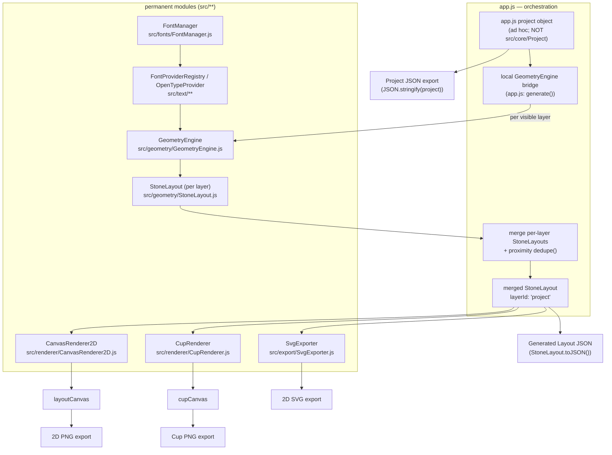
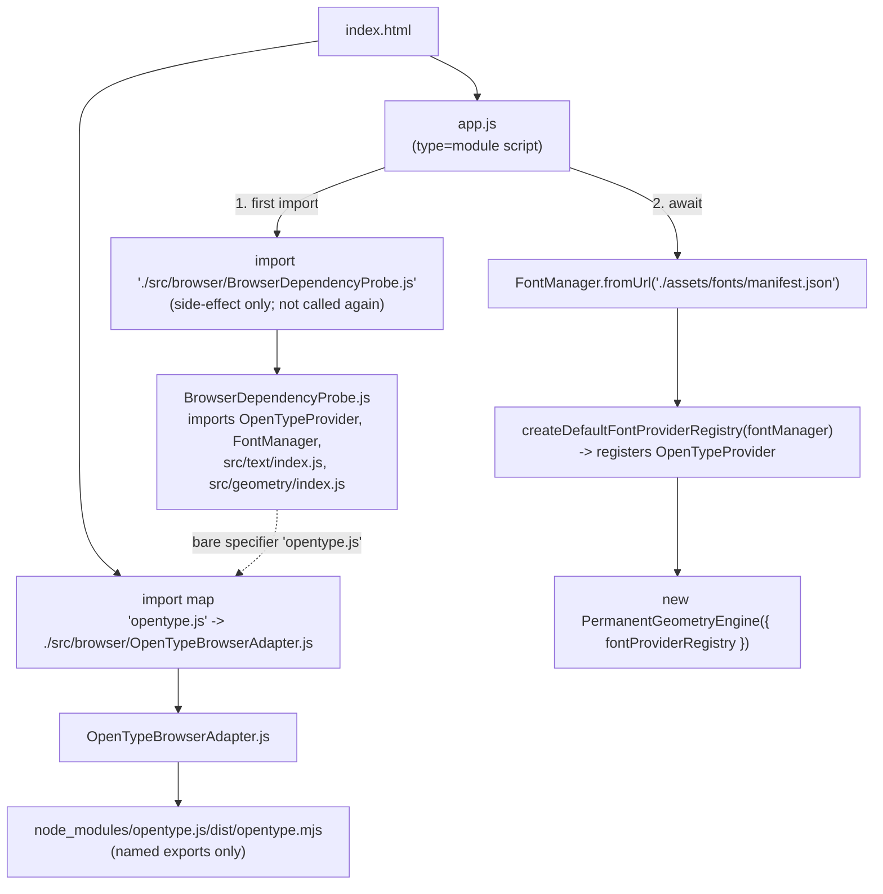
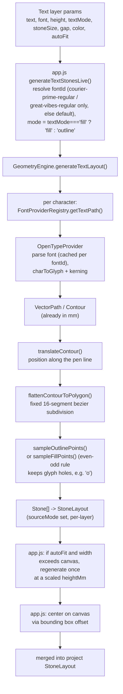
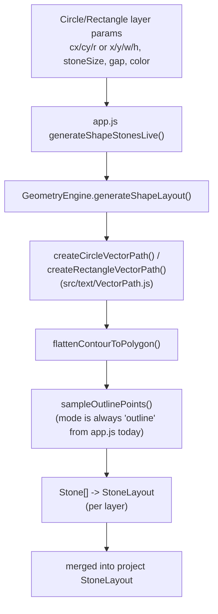
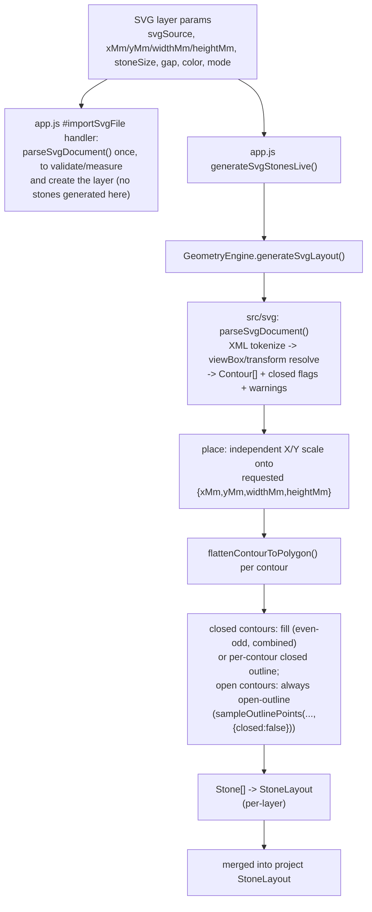
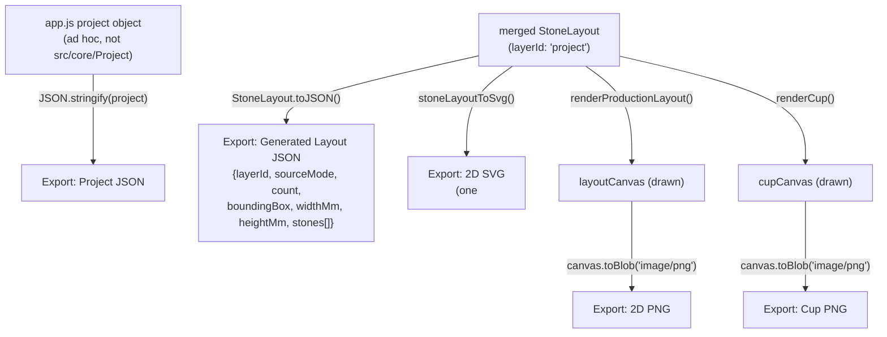

# Rhinestone Studio Architecture

Version: 2.0

Last synchronized with the live repository at commit `5fb768c` (`develop`), which merges
`feature/rs-0003.5c2-unified-rendering-pipeline` (task RS-0003.5C2). Where this document and the
repository disagree, the repository is the source of truth — see `docs/AI_ENGINEER.md`.

---

# Purpose

This document describes the architectural principles of Rhinestone Studio, and — starting with
this revision — the actual state of the implementation against those principles.

Every implementation must follow these principles.

If an implementation conflicts with this document's **principles** (the sections below "Core
Principle" through "Layers"), the implementation is wrong. Where the document's **implementation
status** sections describe orchestration code, adapters, legacy code, or limitations, they are a
factual snapshot, not a license to add more of the same.

Architecture changes require explicit approval.

---

# Vision

Rhinestone Studio is not a rendering application.

It is a manufacturing application.

The goal is to produce accurate crystal placement for real-world products.

Everything else exists to support that goal.

---

# Core Principle

There is only ONE source of truth.

```
Project
        ↓
Geometry Engine
        ↓
StoneLayout
        ↓
+----------------------+----------------------+----------------------+
|                      |                      |                      |
2D Production      3D Preview            Exporters
Canvas             Cup/Bottle            SVG / PNG / JSON / DXF
```

Every consumer uses exactly the same StoneLayout.

No consumer generates geometry.

**Implementation status:** true in the live application as of RS-0003.5C2, extended to imported SVG
layers by RS-1001. Text, shape, and SVG layers all resolve through the permanent
`src/geometry/GeometryEngine.js`, and the 2D canvas, cup preview, SVG export, and Generated Layout
JSON export are all driven from one merged `StoneLayout` object built once per update in `app.js`.
See "Current Implementation" below for the exact call graph and for the one respect in which the
merge step (not stone generation) still lives outside `src/geometry/**`.

---

# Project Model

The project describes WHAT the user wants.

Examples:

- text
- circles
- rectangles
- colors
- layers
- fonts
- sizes

The project never contains pixels.

Everything is stored in millimeters.

**Implementation status:** two project models currently exist and are not the same object.
`src/core/Project.js` / `src/core/Layer.js` implement this principle exactly (a validated,
serializable project/layer model, mm-only, no pixels). `app.js`, however, builds and edits its own
ad hoc plain-object project (`defaultProject()` in `app.js`) and never imports `src/core/**` — a
deliberate, test-enforced exclusion carried forward from RS-0003.5B3 through RS-0003.5C2, not an
oversight. See "Current Architectural Limitations".

---

# Geometry Engine

The Geometry Engine converts a Project into StoneLayout.

Responsibilities:

- text layout
- shape layout
- collision detection
- spacing
- stone placement
- normalization

The Geometry Engine never renders.

**Implementation status:** `src/geometry/GeometryEngine.js` implements text layout
(`generateTextLayout()`), shape layout (`generateShapeLayout()`, circle/rectangle), and — as of
RS-1001 — SVG layout (`generateSvgLayout()`, parsing arbitrary imported SVG source via the new
`src/svg/**` module) with shared contour-flattening (`ContourGeometry.js`) and outline/fill
sampling (`StoneSampler.js`). It has no dependency on the DOM, Canvas, or any renderer/exporter, and
(matching the existing `src/text/**` layering) no dependency on `src/svg/**` running the other
direction — `src/svg/**` only produces neutral `Contour`s, `GeometryEngine` is the only caller that
turns them into stones. "Collision detection" and cross-layer "normalization" are not implemented
inside the Geometry Engine — proximity deduplication across layers is currently performed by
`app.js`'s orchestration code, one layer at a time never re-runs inside the permanent engine (see
"Current Implementation" and "Current Architectural Limitations").

As of RS-1003, `generateTextLayout()` supports an optional circular-arc layout ("curved text") via
six new per-call params (`curveEnabled`/`curveRadiusMm`/`curveDirection`/`curveStartAngleDeg`/
`curveSweepAngleDeg`/`curveAlignment`). The new `src/geometry/ArcProjection.js` module implements
the "Arc projection" pipeline stage: it remaps already-flattened polygon vertices (millimeters,
straight pen-line space) onto a circle, running after `ContourGeometry.js`'s flattening and before
`StoneSampler.js`'s outline/fill sampling, so neither of those modules — nor `StoneLayout`, nor any
renderer/exporter — needed any change. `curveEnabled` defaults to `false`, so straight text is a
byte-identical no-op through this new code path. See
`docs/specifications/RS-1003-CurvedText.md`.

RS-1008 (Image Trace) briefly introduced a real exception to "the Geometry Engine is the only
component allowed to generate stone positions": `src/image/**` constructed `Stone`/`StoneLayout`
instances directly, because that milestone's own brief explicitly forbade modifying
`GeometryEngine.js`/`StoneLayout.js`/`StoneSampler.js`. **This was corrected the same day by
RS-1008A** (Image Trace Architecture Correction) before merge, once the resulting second
stone-generating implementation was flagged as unacceptable for long-term maintenance. As of
RS-1008A, `GeometryEngine.generateImageLayout()` is the only component that constructs `Stone`/
`StoneLayout` for image-traced layers, exactly like every other layer type — see "Image Trace
Geometry Engine (RS-1008A)" below. This paragraph is left in place, rather than deleted, as a
record that the exception existed and was corrected, not merely avoided from the start; see
`docs/specifications/RS-1008A-ImageTraceArchitectureCorrection.md` for the full correction.

As of RS-1008A, `GeometryEngine.js` gained `generateImageLayout()`: it processes an already-decoded
`imageBuffer` via `src/image/index.js`'s `prepareImageField()` (grayscale → threshold → optional
invert → optional blur → optional resize, producing a neutral density field — the raster
counterpart to `src/svg/**`'s vector `Contour`s) and samples it with the new
`StoneSampler.sampleFieldFillPoints()` (grid-walk-and-keep-if-on-field, the raster counterpart to
`sampleFillPoints()`'s grid-walk-and-keep-if-inside-polygon). `src/image/**` now has zero
dependency on `src/geometry/**` and never constructs a `Stone`/`StoneLayout` — mirroring `src/svg/**`'s
existing "only produces neutral input, GeometryEngine is the only caller that turns it into stones"
rule exactly. `generateImageLayout()` is synchronous (no font provider to await), like
`generateShapeLayout()`/`generateSvgLayout()`. See
`docs/specifications/RS-1008A-ImageTraceArchitectureCorrection.md`.

---

# StoneLayout

StoneLayout is the product.

Every stone contains manufacturing information.

Example

- xMm
- yMm
- sizeMm
- color
- layerId

Nothing else should invent stone positions.

**Implementation status:** implemented as `src/geometry/Stone.js` (a single stone) and
`src/geometry/StoneLayout.js` (an immutable collection with `count`, `getBoundingBox()`,
`widthMm`/`heightMm`, and `toJSON()`/`fromJSON()`). `StoneLayout` requires exactly one non-empty
`layerId` per instance — it was designed as a per-generation-call product. `app.js`'s merged,
cross-layer product uses `layerId: 'project'` as a sentinel container id; every `Stone` inside it
still carries its own real per-layer id.

---

# Renderer

The renderer visualizes StoneLayout.

Responsibilities

- draw stones
- lighting
- materials
- camera
- interaction

The renderer never computes geometry.

**Implementation status:** `src/renderer/CanvasRenderer2D.js` (2D production canvas) and
`src/renderer/CupRenderer.js` (cup/mug preview) both consume only `StoneLayout` and plain
viewport/display options — neither references `Project`, `Layer`, or a layer `type`. Both are 2D
Canvas-2D-API renderers. As of RS-1006, a real 3D/WebGL renderer exists in `src/preview3d/**` (see
below) — `CupRenderer.js` is no longer wired into the live app's Object Preview panel, but is kept
unmodified and still exercised by its own pre-existing test suites, matching this codebase's
established "do not remove a module while a test still exercises it" precedent. Layer-aware
interaction (selection outline/handles, drag/resize) is intentionally kept in `app.js`, not in these
modules, since it requires layer awareness the renderer contract deliberately excludes.

As of RS-0003.5D2, the body fill gradient uses a 10-stop cosine falloff (smooth cylindrical
shading) plus a soft translucent sheen, replacing the previous 5-stop abrupt gradient.
`CanvasRenderer2D.js`'s `drawStone()` gained a faint contrast ring for the `'cup'` style only
(`'layout'` style unchanged) so stone colors stay readable against any configurable cup color.
`app.js` gained named `CUP_ROTATION_SENSITIVITY` and `ZOOM_MIN`/`ZOOM_MAX` constants (replacing an
unexplained inline 1:1 drag multiplier and adding an explicit zoom clamp), a
`setNumericSelectValue()` helper fixing the `#stoneSize` dropdown's blank-selection bug, and a
selection-outline/handle contrast halo. None of this changed `StoneLayout`, geometry generation, or
export schemas — see `docs/specifications/RS-0003.5D2-UXVisualPolish.md`.

As of S-001, `CupRenderer.js`'s handle is a real azimuthally-anchored 3D feature rather than a
fixed-flank decal: its azimuth is `HANDLE_AZIMUTH_RAD + rot` (`HANDLE_AZIMUTH_RAD = Math.PI`,
mounted opposite the front-facing design, the same convention a real mug uses), reusing the exact
`rot` term stone placement already used, so handle and stones always stay synchronized under one
rotation value. Both the wall-attachment x-offset and the outward bulge scale by the same signed
`sideFactor = sin(theta)`, giving a full "D" profile at Left/Right and a straight, constant-width
tube seen end-on at Front/Back — never a discrete side flip and never an opacity fade. Whether the
handle draws before or after the body fill is decided by `depthFactor = cos(theta)`'s sign (real
depth ordering, so the wall correctly occludes the part of the loop facing away from the camera);
because `sideFactor`/`depthFactor` are 90 degrees out of phase, that draw-order switch always
coincides with the handle's maximum lateral extent (fully clear of the body silhouette), so it is
never visible as a pop. The handle itself is drawn as a single stroked, round-capped tube (not a
separately outlined fill), so it cannot self-intersect/twist at any angle and its thickness never
collapses to a hairline even when the bulge does. `app.js` gained a small `updateViewButtons()`
helper (using a named `VIEW_ANGLE_EPSILON_DEG` and mod-360-aware `angleDiffDeg()`) called from
`updateAll()`, so the Front/Left/Right/Back buttons' highlighted state stays synchronized with
`rotation` regardless of how it changed (button click, reset, slider, or manual cup-drag). Per
`docs/ARCHITECTURE.md`'s own note above, a true right-cylinder/frustum body silhouette is
rotation-invariant around its own vertical axis under a fixed camera (a real mug's outline does not
change when spun) — the body silhouette/shading are therefore deliberately left unchanged; faking a
silhouette or shading response to rotation would be a visual hack, not a fix. No `StoneLayout`,
geometry, or export schema changed — see
`docs/specifications/S-001-CupRenderingStabilization.md`.

As of RS-1006, the Object Preview panel's fake 2D schematic is replaced by a real, interactive
Three.js 3D preview: `src/preview3d/**` (`ObjectDimensions.js`, `StoneLayoutTexture.js`,
`ObjectGeometryBuilder.js`, `Preview3DRenderer.js`, `index.js`), consuming only a `StoneLayout` plus
plain display options (`cupColor`, `wrap`, `objectTemplate`, and the live `project.canvas` mm size)
— the exact same contract `CupRenderer.js` already followed, extended with the live mm canvas size
so the mesh and its canvas texture share one real millimeter scale (a 2D "fit to viewport" renderer
never needed this). A real revolved `THREE.Mesh` per object template (a tapered open cylinder for
mug/tumbler, a `LatheGeometry`-revolved profile for the bottle's body+shoulder+neck+cap, a
`TubeGeometry` handle for the mug) replaces the 2D silhouette; a canvas texture generated directly
from `StoneLayout` (`StoneLayoutTexture.js`) is mapped onto the body surface across an angular
window sized by the current wrap mode (`ObjectGeometryBuilder.js`'s `applyWrapUv()`); one ambient
and one directional light replace the previous hand-drawn 2D gradients; `OrbitControls` provides
damped mouse rotate/zoom/pan directly on the canvas, superseding `app.js`'s previous custom
pointer-drag-to-rotate handler and its `CUP_ROTATION_SENSITIVITY` constant (both removed). The
Rotation slider, Zoom slider, Front/Left/Right/Back preset buttons, and Reset view button still
work, now driving the 3D camera (`preview3D.syncView()`/`preview3D.resetView()`) instead of the 2D
silhouette's `rotationDeg`/`zoom` parameters — a manual orbit/pan in progress is never interrupted
by an unrelated project edit, since the camera is only repositioned when those specific values
actually change. Three.js is loaded exactly the way `opentype.js` already is — an `index.html`
import-map entry (`"three": "./node_modules/three/build/three.module.js"`) plus a direct relative
import of `OrbitControls` from `node_modules/three/examples/jsm/controls/OrbitControls.js` — no
bundler, no CDN — and is lazy-loaded via a dynamic `import()` inside `Preview3DRenderer.js`, which
only `src/preview3d/index.js`'s synchronous facade (the one module `app.js` statically imports)
ever triggers. `StoneLayout`/`GeometryEngine` are untouched; no exporter is touched — `#exportCup`'s
existing `canvas.toBlob()` capture keeps working unmodified because the new `WebGLRenderer` is
created with `preserveDrawingBuffer: true`. See `docs/specifications/RS-1006-Real3DPreview.md`.

As of RS-1007, the 7-entry hard-coded stone-color palette is replaced by a permanent 17-color
crystal-color catalog: `src/renderer/CrystalColors.js` (id/name/`previewColor`/optional
`highlight`/`shadow`/`group`, plus the pre-existing `fill`/`stroke`/`shine`/`accent` render-channel
fields, aliased 1:1 so both naming schemes always agree). `src/renderer/StoneColors.js` becomes a
one-line compatibility re-export of the same `STONE_COLORS` id-keyed map from that catalog, so its
five pre-existing consumers (`CanvasRenderer2D.js`, `CupRenderer.js` via `drawStone`,
`StoneLayoutTexture.js`, `SvgExporter.js`, `ProductionSheetExporter.js`) and `app.js`'s own
`STONE_COLORS` import needed zero changes — every one of them already resolved a stone's color
generically via `STONE_COLORS[stone.color]`, so growing the catalog's *content* required no
renderer/exporter change, only the catalog module itself and the color-picker UI. The 7
pre-existing ids keep byte-identical `fill`/`stroke`/`shine`/`accent` values (backward
compatibility for projects saved before this milestone); `jet`'s display name changed from "Jet
Black" to "Jet" (same id/color) to match the new catalog's required name list. `app.js`'s
`#stoneColor` select is now populated at startup from `STONE_COLORS`, grouped into `<optgroup>`s by
each color's `group` field, with a live swatch (`#stoneColorSwatch`) showing the selected
`previewColor`. `Stone.color` remains a free string; no catalog-id validation was added to
`src/geometry/**`. See `docs/specifications/RS-1007-CrystalColorLibrary.md`.

---

# Exporters

Exporters consume StoneLayout.

Examples

- SVG
- PNG
- JSON
- DXF
- Stone Reports

Exporters never generate geometry.

**Implementation status:** `src/export/SvgExporter.js` (`stoneLayoutToSvg()`) is a pure
string-generation exporter with no DOM/Canvas dependency — implemented and consuming only
`StoneLayout`. "Generated Layout JSON" export uses `StoneLayout.toJSON()` directly (no separate
exporter module needed); its schema is documented in `src/geometry/README.md`. "PNG" export is
`canvas.toBlob()` against whichever canvas `CanvasRenderer2D`/`CupRenderer` last drew — a real
export of the rendered `StoneLayout`, but implemented as a render-then-capture step rather than a
standalone `src/export/**` module. DXF export and Stone Reports do not exist yet.

As of RS-1005, a **Production Sheet** export exists: `src/export/ProductionSheetExporter.js`
(`computeProductionSheetLayout()`, `productionSheetToSvg()`, `productionSheetToPdf()`) turns the
same merged `StoneLayout` plus plain display metadata (project name, active object template's
`displayName`, `project.canvas`, visible layers' `gap` values, page size, margin, mirror,
registration-marks) into a one-page, millimeter-accurate manufacturing document: header metadata,
a labeled 50mm scale-reference bar, optional corner registration marks, and the stones themselves
drawn at true 1:1 size (never fit-to-viewport-scaled), optionally horizontally mirrored, centered
in the printable area. A production size that cannot fit the chosen page (A4 or Letter) in either
orientation at the requested margin throws a clear error rather than silently rescaling. SVG output
reuses a new `stoneCircleSvg()` helper extracted from `SvgExporter.js` (output byte-for-byte
unchanged for the pre-existing `stoneLayoutToSvg()` export). PDF output is produced by a new,
generic, dependency-free `src/export/PdfDocument.js` — a minimal single-page vector PDF writer
(lines/rects/circles/text) over the standard, non-embedded Helvetica font (WinAnsiEncoding; text
outside Latin-1 degrades to `?`, a documented limitation). PNG export of the production sheet has
no new `src/export/**` module: `app.js` rasterizes the generated SVG via an offscreen `Image`+
`<canvas>` at a fixed DPI, the same "capture, not a standalone exporter" shape `#exportPNG`/
`#exportCup` already use. Neither new module depends on `GeometryEngine`, `Project`, `Layer`, or a
layer `type` — see `docs/specifications/RS-1005-ProductionSheetGenerator.md`.

As of RS-0003.5D1, `stoneLayoutToSvg()` validates its inputs (throws a clear `TypeError` for a
malformed `stoneLayout` or a non-positive/non-finite `widthMm`/`heightMm`) and each `<circle>`
carries the stone's original color id as a `data-color` attribute, alongside the existing display
`fill`/`stroke`. `app.js`'s five export button handlers now guard on the generated `layout` being
present and are wrapped in `try`/`catch`, so a not-yet-ready layout or a thrown exporter error
surfaces a specific message in the status bar instead of an uncaught exception. `app.js` also
gained a Project JSON *import* path (`#importProject`/`#importProjectFile`) — the first import
capability for either export format — which validates a parsed file against the same ad hoc
project/layer shape `#exportProject` already produces and rejects anything else with a specific
error, leaving the current in-memory project untouched on failure. A repository-wide search found
no code depending on the pre-RS-0003.5C2 Generated Layout JSON shape (`{version,units,canvas,
stones:[{x,y,d}],bbox,stats}`), so no versioned compatibility layer for it exists or is needed.

---

# Validation Engine

Validation checks correctness.

Examples

- duplicate layers
- invalid geometry
- overlapping stones
- missing fonts

Validation never changes data.

**Implementation status:** not implemented as a dedicated module. `src/core/Project.js.validate()`
checks canvas dimensions, units, and duplicate layer ids, but it operates on the unused
`src/core/Project` model, not on `app.js`'s live ad hoc project object — so this validation does
not currently run against anything the live app edits. There is no overlap or missing-font
validation anywhere in the codebase; a missing font manifest is instead handled as a runtime error
surfaced in the status bar (see "Current Architectural Limitations").

---

# Units

Internal unit:

millimeters

Rendering may convert to pixels.

Manufacturing always remains millimeters.

**Implementation status:** true everywhere in `src/geometry/**`, `src/text/**`, and
`src/renderer/**`/`src/export/**` — all internal fields are named with an explicit `Mm` suffix
(`xMm`, `heightMm`, `stoneSizeMm`, ...), and pixel conversion happens only inside
`CanvasRenderer2D.fitTransform()` / `CupRenderer`'s local transform math.

---

# Product Plugins

Products are plugins.

Examples

- Mug
- Tumbler
- Bottle
- Wine Glass

Every product supplies:

- printable area
- surface mapping
- preview geometry

Products never generate layouts.

**Implementation status:** implemented as of RS-1004, by activating the previously-inert
`src/products/**` module and `project.product` field (RS-0003.5B1 already carried `product:'mug'`
on the ad hoc project object; nothing read it until now). `src/products/ObjectTemplate.js` defines
a small, validated registry of three templates (`mug`, `tumbler`, `bottle`) — each a plain data
record (display name, `productionWidthMm`/`productionHeightMm`, a `safeAreaInsetMm`, a supported/
default wrap mode, and schematic preview-silhouette parameters). A template never generates a
`StoneLayout` and is never referenced by `src/geometry/**`; `app.js`'s new "Object type" control
sets `project.product` (one discrete, undoable action that also resets `project.canvas`/
`project.wrap` to that template's defaults) and forwards the resolved template to
`CupRenderer.renderCup()` as a plain `objectTemplate` display option — exactly the same kind of
plain option `cupColor`/`wrap` already were, not a `Project`/`Layer` reference. `renderCup()` now
draws three silhouette variants (mug: tapered + handle; straight tumbler: equal top/bottom width,
no handle; bottle: narrower body + shoulder/neck/cap, no handle) from one shared frustum + stone-
wrap-placement math; omitting `objectTemplate` falls back to the exact pre-RS-1004 hardcoded mug
constants, so no other caller/test changed behavior. A safe-area guide rectangle (derived from the
active template's `safeAreaInsetMm` at the current `project.canvas` size) is drawn on the 2D
Production Layout canvas as an `app.js` editor overlay (`drawSafeAreaGuide()`, alongside the
pre-existing selection-outline/HUD-text overlays) — not inside `CanvasRenderer2D.js`, which remains
untouched. Unknown/missing `product` values fall back to `'mug'` (matching this file's existing
permissive style for `cupColor`/`wrap`), so every pre-RS-1004 Project JSON opens identically. See
`docs/specifications/RS-1004-MultiObjectTemplates.md`.

---

# Text Engine

Fonts are providers.

Future providers may include

- OpenType
- SVG
- Variable Fonts
- Hershey Fonts

Every provider returns vector paths.

The Geometry Engine samples those paths.

**Implementation status:** implemented via `src/text/IFontProvider.js` (the provider contract),
`src/text/OpenTypeProvider.js` (the only OpenType-aware module in the codebase), and
`src/text/FontProviderRegistry.js` (provider selection). `src/text/defaultFontProviders.js` wires
one `OpenTypeProvider` as the default/only registered provider. No SVG-font, variable-font, or
Hershey-font provider exists yet — the registry supports registering more, but only OpenType is
implemented.

---

# Layers

Every design element is a layer.

Examples

- Text
- Circle
- Rectangle
- Logo
- SVG

Layers never render themselves.

**Implementation status:** `src/core/Layer.js` defines `TextLayer`/`CircleLayer`/`RectangleLayer`
(plus generic `svg`/`manual` layer type slots; `svg` still has no `src/core/Layer.js` params
factory, since `src/core/**` remains unused by the live app — see "Current Architectural
Limitations"). `app.js`'s live project object independently supports four editable layer types
(text/circle/rectangle/svg) as plain objects, not `Layer` instances. As of RS-1001, an `svg` layer
is generated by the permanent Geometry Engine (`GeometryEngine.generateSvgLayout()`, via the new
`src/svg/**` vector-path-extraction module) and reuses the same generic x/y/width/height
selection/drag/resize/duplicate editing code the `rectangle` layer already used, so no new editor
UI logic was needed beyond a fill/outline mode control and an import button. `manual` (logo) layers
remain unimplemented in both models.

As of RS-1008, `app.js` also supports a fifth editable layer type, `image` (Image Trace): a bitmap
(PNG/JPG/JPEG/WebP) traced through `src/image/**`'s grayscale/threshold/invert/blur/resize
pipeline and the permanent `GeometryEngine`'s grid-sample stage into stones, reusing the exact same
generic x/y/w/h placement-box editing (move/resize/duplicate/hide/delete/undo/redo) `rectangle`/`svg`
layers already share. As of RS-1008A, `image` stones ARE produced by the permanent `GeometryEngine`
(`generateImageLayout()`), exactly like every other layer type — see the "Geometry Engine" section
above for the correction's history, and `docs/specifications/RS-1008A-ImageTraceArchitectureCorrection.md`
for the full reasoning. `src/core/Layer.js` gains no new reserved layer-type slot for `image` (it
remains unused by the live app, same documented gap as `svg`/`manual`).

As of RS-1009, `text` layers gain optional `x`/`y` mm offset fields (default `0`, read via
`layer.x||0`), making them movable/alignable/snappable for the first time — previously a `text`
layer had no position field at all and was always auto-centered on the canvas, and `hitTest()`
deliberately returned a non-draggable `'select'` kind for it. `generateTextStonesLive()`'s existing
auto-center math is unchanged; `x`/`y` are added on top as a further offset, so a Project JSON file
saved before RS-1009 (no `x`/`y` on its text layers) renders byte-identical to before. `src/core/
Layer.js` gains no corresponding field (same documented gap as every other RS-1009-touched
concept — `src/core/**` remains unused by the live app).

---

# Editing (Alignment & Snapping)

Multi-select, alignment, distribution, and snapping are editor concerns, not geometry: they
operate on layer bounding boxes in millimeters (the same mm values `StoneLayout`/`Stone` already
use, but never generated stone positions directly) and never trigger a second geometry-generation
implementation.

**Implementation status:** implemented as of RS-1009 via `src/editing/**`
(`EditingConstants.js`, `AlignmentEngine.js`, `SnapEngine.js`, `Selection.js`, consumed only
through `index.js`), a new permanent module with the same "pure, DOM-free, consumed only through
its barrel" shape every other permanent module already has — `src/geometry/**`, `src/renderer/**`,
`src/export/**` are untouched, and `src/editing/**` has no dependency on any of them or on
`Project`/`Layer`/`StoneLayout`. `app.js` is the only caller: it computes each layer's bounding box
(reusing its existing `getLayerBBox()`), asks `src/editing/**` for the alignment/distribution
delta or the drag-time snap offset (in mm), and applies the result itself through two small new
per-type helpers, `getLayerPosition(layer)`/`setLayerPosition(layer,xMm,yMm)` — the one place that
knows a given layer's position field names (`cx`/`cy` for `circle`, `x`/`y` for everything else).
Multi-selection is one `Set<string>` (`selectedLayerIds` in `app.js`), mutated only through
`src/editing/Selection.js`'s four pure functions (`selectOnly`/`toggleSelection`/
`clearSelection`/`selectMany`, the last added by RS-1010 — see below) — every entry point that
changes selection (canvas click, layers-list click, the layer dropdown, new/duplicate/delete/
import, Alt-drag duplicate) goes through the same functions, so there is exactly one selection
model. Selection, the drag-time snap-guide overlay, the snap-enabled toggle, the configurable snap
distance, and the show-guides toggle are view-only editor state, exactly like `rotation`/`zoom`
already were: never part of `project`, never in the undo/redo snapshot, never in exported Project
JSON. See `docs/specifications/RS-1009-AlignmentSnapping.md`.

**RS-1010 (Alignment & Snapping Upgrade):** extends the RS-1009 `app.js` wiring, not
`src/editing/**`'s snapping/alignment math (`SnapEngine.js`/`AlignmentEngine.js` already accepted
a configurable tolerance and already snapped each axis independently, which is what
corner-to-corner snapping needs — no new target type was required). Four additions, all in
`app.js`/`index.html`:
* `snapToleranceMm` (view-only state, default `SNAP_TOLERANCE_MM`) replaces the fixed constant as
  `computeSnapOffset()`'s third argument — the Settings Lightbox's "Snap Distance" field.
* `showSnapGuides` (view-only state, default `true`) gates only the temporary guide *lines drawn*
  during a snap; snapping itself stays governed by `snapEnabled` alone — the Settings Lightbox's
  "Show Alignment Guides" checkbox.
* Shift held during a move-drag constrains movement to whichever axis moved further from the drag
  start, applied *after* snapping so the locked axis is exactly the drag-start value, never nudged
  by a nearby snap target.
* Alt/Option held on pointerdown duplicates the whole current selection (deep-cloned, pushed onto
  `project.layers`, one `commitHistory()` shared with the following move so duplicate+drag is one
  undo step) and drags the copies, leaving the originals in place. Selecting the new copies needed
  a genuinely new primitive — `src/editing/Selection.js`'s `selectMany(ids)` — since no existing
  function expressed "select several specific ids at once"; it is the one, small (three-line)
  change to `src/editing/**` this milestone made, preserving "no second selection model."
See `docs/specifications/RS-1010-AlignmentSnappingUpgrade.md`.

---

# User Interface (UI-001 Redesign)

The application shell is a top menu, a left project/layer panel, a large central 2D/3D workspace,
an optional compact right inspector, and one reusable Lightbox/dialog system for full-parameter
editing — replacing a single long scrolling sidebar that previously stacked every control for
every layer type.

**Implementation status:** implemented as of UI-001. A new permanent module, `src/ui/**`
(`Lightbox.js`, consumed only through `index.js`), is a generic, DOM-only dialog controller (open/
close, focus trap, Escape-to-close, backdrop click, ARIA) with zero knowledge of `Project`/`Layer`/
`StoneLayout`/layer type — the same "pure, consumed only through its barrel" shape every other
permanent module already has (`src/editing/**`, `src/history/**`, ...). `app.js` is the only
caller: it constructs one `Lightbox` per dialog (Text, Shapes, Import, Image Trace, Export,
Production Sheet, Shipping & Handling, Settings, Help) and wires each to its top-menu button.

Every control that existed before UI-001 keeps its exact DOM `id` and its exact `app.js` wiring —
`el(id)` lookups, event listeners, and `HISTORY_TRACKED_CONTROL_IDS` are all unchanged for
pre-existing fields — only each field's *location* in the DOM changed (moved into a Lightbox, the
left panel, or the workspace toolbar). Two fields the milestone brief required in both a Lightbox
(the "complete parameter editor") and the compact right inspector (the "quick-edit surface") —
shape position/size (`shapeX`/`shapeY`/`shapeW`/`shapeH`) and the shared stone fields
(`stoneSize`/`gap`/`stoneColor`) — are each exactly one physical DOM node, relocated via
`appendChild` (which preserves bound listeners) between an inspector "home" slot and whichever
Lightbox is currently open, so there is never a duplicate id or a second independent copy of the
same value. Two genuinely new fields were added: `textX`/`textY` (mm), exposing the `layer.x`/
`layer.y` fields RS-1009 already added to text layers but never gave a manual input for.

Two new pieces of app.js-local, view-only editor state were added, exactly like `rotation`/`zoom`/
`snapEnabled` already were (never part of `project`, never undo/redo-tracked, never exported): which
workspace tab (2D canvas / Object Preview) is active, and `showSafeArea` (gates the pre-existing
`drawSafeAreaGuide()` overlay call). A real "grid toggle" was investigated and deliberately dropped:
`drawGrid()` is called unconditionally inside the permanent `src/renderer/CanvasRenderer2D.js`, and
building a working toggle would require changing that module plus amending roughly ten unrelated
milestones' own `git status`-based forbidden-file guards — a blast radius far larger than the
control itself, for something that was never toggleable before. `src/renderer/**` is therefore
untouched by UI-001; the workspace shows a plain "grid always on" label instead of a non-functional
control.

Shipping & Handling is a new Lightbox with local, session-scoped-only metadata fields (package
type/dimensions/weight/notes/fragile) — intentionally not added to `project` / Project JSON /
`validateProject()` / undo-redo this milestone (see
`docs/specifications/UI-001-CompleteRedesign.md`). It has no carrier/rate/label/tracking
integration.

See `docs/specifications/UI-001-CompleteRedesign.md` for the full feature-to-UI inventory table.

---

# User Interface

The UI edits the Project.

The UI never edits StoneLayout directly.

Whenever the Project changes:

Project

↓

Geometry Engine

↓

StoneLayout

↓

Renderer + Exporters

**Implementation status:** true in the live app. All layer edits (typing text, dragging a shape,
changing stone size/color/gap) mutate `app.js`'s project object only; every mutation calls
`updateAll()`, which regenerates the whole `StoneLayout` from scratch and redraws every consumer
from it. Nothing in `app.js` mutates a `Stone` or `StoneLayout` in place.

---

# History (Undo/Redo)

History records Project state, never generated geometry.

Undo/redo restores a prior Project; it never restores or duplicates a `StoneLayout` — the layout is
always regenerated from the restored Project, exactly like a live edit.

**Implementation status:** implemented via `src/history/HistoryManager.js` (RS-1002), a generic,
dependency-free undo/redo stack consumed only through `src/history/index.js`. It knows nothing about
`Project`/`Layer`/`StoneLayout`/the DOM — `app.js` is the only caller, and it only ever passes
`{project,selectedLayerId}` snapshots (JSON-serialized, never a live object graph). Every discrete
editing action (add/duplicate/delete a layer, toggle visibility, import an SVG layer, start a
shape drag) commits one undo step immediately before mutating; continuous field edits (typing,
slider drags) coalesce every event of one edit session into a single undo step via
`HistoryManager.beginSession()`/`endSession()`. Undo/redo depth is bounded by a configurable
`maxSize` (`HISTORY_MAX_SIZE` in `app.js`, default 100) — otherwise unlimited. Importing a Project
JSON file clears history entirely (a fresh project is not an undoable edit); none of the five export
actions touch history in any way, so history survives exports. `Ctrl/Cmd+Z` (`+Shift` redoes) and
`Ctrl/Cmd+Y` (redo) are wired globally, taking precedence over any native browser input-level undo.
A "Saved"/"Unsaved changes" indicator compares the live project against a baseline updated on load,
Project JSON import, and Project JSON export.

---

# Current Implementation

This section describes how the principles above are actually realized in the live browser
application as of RS-0003.5C2, and is expected to change as future milestones land. The
normative principles above this section do not change; this section is the map from principle to
code.

## Layer map

| Layer | Modules | Depends on |
|---|---|---|
| Project/Layer model (unused by the live app) | `src/core/**` | nothing else in `src/**` |
| Font registry | `src/fonts/**` | nothing else in `src/**` |
| Vector text/shape providers | `src/text/**` | `src/fonts/**` (for font records), `opentype.js` |
| Vector SVG import (RS-1001) | `src/svg/**` | `src/text/VectorPath.js` (Contour/Point2D primitives, `createCircleVectorPath`/`createRectangleVectorPath`) |
| Geometry generation | `src/geometry/**` | `src/text/**` (VectorPath primitives, FontProviderRegistry), `src/svg/**` (`parseSvgDocument`) |
| 2D + cup rendering | `src/renderer/**` | `src/geometry/**` (StoneLayout, Stone) |
| Export | `src/export/**` | `src/geometry/**`, `src/renderer/StoneColors.js` |
| Browser compatibility | `src/browser/**` | `src/text/**`, `src/fonts/**`, `src/geometry/**` (proves resolution), `opentype.js` |
| Undo/redo history (RS-1002) | `src/history/**` | nothing else in `src/**` (pure JSON-snapshot bookkeeping; no `Project`/`Layer`/`StoneLayout`/DOM dependency) |
| Object templates (RS-1004) | `src/products/**` | nothing else in `src/**` (pure data + validation; never referenced by `src/geometry/**` or `src/renderer/**`, only consumed by `app.js` as plain display-option data) |
| Bitmap image trace (RS-1008, corrected RS-1008A) | `src/image/**` | nothing else in `src/**` (pure field-preparation only: grayscale/threshold/invert/blur/resize -> a neutral density field; zero dependency on `src/geometry/**`, mirroring `src/svg/**`) |
| Alignment, distribution, snapping, selection (RS-1009; `selectMany` added RS-1010) | `src/editing/**` | nothing else in `src/**` (pure mm-geometry and `Set<string>` selection helpers only; zero dependency on `src/geometry/**`/`src/renderer/**`/`src/export/**`/`Project`/`Layer`/`StoneLayout`) |
| Lightbox/dialog controller (UI-001) | `src/ui/**` | nothing else in `src/**` (pure DOM dialog behavior only: open/close, focus trap, Escape, backdrop click, ARIA; zero dependency on `Project`/`Layer`/`StoneLayout`/layer type) |
| Orchestration | `app.js` | every barrel module above except `src/core/**`, plus `src/svg/index.js` (pre-import validation only, not stone generation), `src/history/index.js` (undo/redo), `src/products/index.js` (RS-1004, object templates), `src/image/index.js` (RS-1008, image field preparation only as of RS-1008A), `src/editing/index.js` (RS-1009, alignment/snapping/selection decisions only, never geometry), and `src/ui/index.js` (UI-001, dialog open/close/focus behavior only, never geometry) |

Every permanent module (`src/core`, `src/fonts`, `src/text`, `src/geometry`, `src/renderer`,
`src/export`) is consumed only through its `index.js` barrel — `app.js` never imports an internal
file directly, and `src/renderer/**`/`src/export/**` contain no reference to `Project`, `Layer`,
or a layer `type` string, enforced by `tools/test-render-export-pipeline.mjs`.

## 1. Overall application data flow



The box labeled "app.js — orchestration" is not part of the permanent architecture: it is the one
place the cross-layer merge/dedupe step and the two competing project models currently meet. See
"Orchestration Layer" and "Current Architectural Limitations" below.

## 2. Browser startup and dependency loading



`BrowserDependencyProbe.js` exists solely to force the whole permanent-module import graph
(`src/text/**`, `src/fonts/**`, `src/geometry/**`, and transitively `opentype.js` through the
import map) to resolve before `app.js` runs any live logic. Its exported
`getBrowserDependencyProbeStatus()` function is never called by `app.js` or by any test — the
import's side effect (throwing at load time if resolution fails) is the entire contract.

`OpenTypeBrowserAdapter.js` exists because `src/text/OpenTypeProvider.js` imports `opentype.js` as
a default import (matching Node's CommonJS/UMD resolution of the package), while the browser's
import map instead resolves the same bare specifier to `opentype.js`'s native ES-module build,
which has no default export. The adapter re-exports that build's named `parse` export as a
default export so `OpenTypeProvider.js` itself needs no browser-specific branch.

## 3. Text-generation flow



Auto-fit is a single deterministic rescale, not an iterative fitter: if the first pass's
`widthMm` exceeds `canvas.width - 10`, `app.js` calls `generateTextLayout()` exactly once more at
a linearly scaled `heightMm`. It does not loop or re-check the second result.

## 4. Shape-generation flow



Shape generation is synchronous (no font provider to await) and converges on the exact same
`flattenContourToPolygon()` / `sampleOutlinePoints()` / `Stone`/`StoneLayout` pipeline that text
generation uses — this is the "one Geometry Engine, one product" principle holding in practice,
not just in the diagram at the top of this document. `generateShapeLayout()` supports a `'fill'`
mode identical in shape to text's, but `app.js` never requests it for circle/rectangle layers
today (always passes `mode: 'outline'`).

## 5. SVG-generation flow (RS-1001)



`app.js` never parses SVG geometry itself: `parseSvgDocument()` (imported directly from
`src/svg/index.js`, the only `src/svg/**` symbol `app.js` touches) is called once at import time
purely to validate the file and measure its natural millimeter size for the new layer's default
placement — it produces `Contour`s, not `Stone`s, so this does not violate "only the Geometry
Engine generates stone positions". Actual stone generation for the layer always goes through
`generateSvgStonesLive()` -> `PermanentGeometryEngine.generateSvgLayout()`, which re-parses
`svgSource` internally (a second, cheap parse — the same "two totally separate validation passes"
shape already used by `validateProject()`/`generate()` for Project JSON import).

## 6. Export flow



All five export buttons share one `download()`/`exportCanvas()` helper in `app.js` that creates an
object URL and clicks a synthetic `<a download>` element. None of the exporters mutate the
`StoneLayout` or the project object they read from. "PNG" exports are not driven by a dedicated
`src/export/**` PNG module — they capture whatever `CanvasRenderer2D`/`CupRenderer` most recently
drew onto the two `<canvas>` elements, so a PNG export is only correct if it runs after the
corresponding render call in the same `updateAll()` pass (true today, since both happen
synchronously in sequence).

---

# Orchestration Layer (`app.js`)

`app.js` is the browser entry point loaded by `index.html` (`<script type="module" src="./app.js">`).
It is explicitly **not** part of the permanent architecture — it is the composition root that
wires permanent modules together and owns everything that requires simultaneous knowledge of
layers, UI state, and the DOM. Per its own header comment and `tools/test-app-module-migration.mjs`,
it may only import the barrel (`index.js`) entry points of `src/geometry`, `src/fonts`, `src/text`,
`src/renderer`, `src/export`, `src/svg` (RS-1001), `src/history` (RS-1002), `src/products`
(RS-1004), and the side-effect-only `src/browser/BrowserDependencyProbe.js` — it is test-enforced
to never import `src/core/**` or any internal file of another module directly.

`app.js` owns:

- **The ad hoc project/layer state** — `defaultProject()` and all layer mutation functions
  (`writeSelectedControlsToLayer()`, `duplicateLayer()`, `deleteLayer()`, drag/resize handlers).
  This is a parallel, unreconciled implementation of what `src/core/Project.js`/`Layer.js` already
  model (see "Current Architectural Limitations").
- **A local bridge `GeometryEngine` class** (confusingly same-named as the permanent
  `src/geometry/GeometryEngine.js`, imported into `app.js` as `PermanentGeometryEngine`) whose live
  methods (`generate()`, `generateTextStonesLive()`, `generateShapeStonesLive()`) call into the
  permanent engine per layer, then merge the resulting per-layer `StoneLayout`s and run a
  proximity `dedupe()` before wrapping the survivors into one project-level `StoneLayout`.
- **Editor-only overlay drawing** — selection outline/handles, the reference grid's HUD text, and
  pointer-driven drag/resize/hit-testing — layered on top of (not inside) the permanent renderers'
  output, reusing the `{s, ox, oy}` transform `renderProductionLayout()` returns.
- **Canvas lifecycle** — DPR-aware resize (`resizeCanvas()`), and calling
  `renderProductionLayout()` / `renderCup()` once per `updateAll()`.
- **Export button wiring** — see the export flow diagram above.
- **UI event wiring** — every `<input>`/`<select>`/`<button>` listener in `index.html`.

---

# Browser Compatibility Adapters

Two files exist solely to reconcile Node-oriented module code with the browser's native ES-module
resolution; neither contains product logic:

- **`src/browser/OpenTypeBrowserAdapter.js`** — re-exports `opentype.js`'s ES-module build
  (`node_modules/opentype.js/dist/opentype.mjs`, named exports only) as a default export, matching
  what `src/text/OpenTypeProvider.js` expects from the bare `opentype.js` specifier under Node.
  Activated only via `index.html`'s import map (`"opentype.js": "./src/browser/OpenTypeBrowserAdapter.js"`);
  Node-side tests never touch it, since Node resolves the real npm package directly.
- **`src/browser/BrowserDependencyProbe.js`** — a side-effect-only import that forces the entire
  permanent module graph (and, transitively, the import map) to resolve at page load, before any
  live font/geometry call happens. See the startup diagram above.

---

# Remaining Legacy / Dead Code

The following code is physically present but not reachable from any live code path in the running
application. It is retained, not removed, per `docs/AI_ENGINEER.md`'s "do not refactor unrelated
code" and prior milestones' explicit "do not remove until no live behavior depends on it":

- **`app.js`'s legacy bitmap text engine** — the `FONT5` 5x7 glyph grid constant and the
  `GeometryEngine` class methods `generateText()`, `sampleGlyphFill()`, `sampleGlyphStroke()`.
  Superseded by `generateTextStonesLive()` (the permanent `GeometryEngine`/OpenType path) as of
  RS-0003.5B3.
- **`app.js`'s legacy shape generators** — `generateCircle()`, `generateRect()`. Superseded by
  `generateShapeStonesLive()` as of RS-0003.5C1.
- **`app.js`'s `engine.bbox()` and `layerBBox()`** — both fully unused as of RS-0003.5C2 (their
  two remaining call sites were replaced by real `StoneLayout`/`getLayerBBox()` usage this
  milestone).
- **Shared helpers still live because dead code depends on them** — `line()` (used only by
  `sampleGlyphStroke()`/`generateRect()`) and `dedupe()` (used by both the dead legacy generators
  *and* the live cross-layer merge in `generate()` — do not rename or remove `dedupe()`'s `.x/.y/.d`
  field convention without first deleting or migrating the legacy callers, or it silently becomes
  a no-op filter for them).

A future cleanup milestone should delete the bitmap text engine, the legacy shape generators, and
`bbox()`/`layerBBox()` together, once a human confirms the permanent-engine/renderer output is
production-acceptable (recommended in every `TASK_RESULT.md` since RS-0003.5C1 and still not
scheduled).

---

# Current Architectural Limitations

1. **Two unreconciled project/layer models.** `src/core/Project.js`/`Layer.js` fully implement
   this document's Project Model principle (validation, serialization, typed layers) but are not
   imported by `app.js` — enforced as a deliberate exclusion by
   `tools/test-app-module-migration.mjs`. The live app instead edits an ad hoc plain-object
   project. Until these converge, `src/core/**`'s validation and serialization guarantees do not
   apply to anything a user actually edits.
2. **Cross-layer merge lives outside the Geometry Engine.** The proximity `dedupe()` that merges
   per-layer `StoneLayout`s into one project-level `StoneLayout` runs in `app.js`'s orchestration
   code, not in `src/geometry/GeometryEngine.js`. It only filters already-generated stones by
   proximity (it invents no new positions), so it does not violate "only the Geometry Engine
   generates stone positions" — but it means the permanent engine has no native multi-layer
   aggregation API, and `StoneLayout`'s single-`layerId` constructor is worked around with a
   `'project'` sentinel rather than a real multi-layer representation.
3. **Legacy dead code remains physically present** in `app.js` (see above), sharing helper
   functions with live code, which is a latent-bug risk if those helpers are ever changed without
   accounting for the dead callers.
4. **The font manifest's `enabled` flag does not gate what can actually be loaded.**
   `assets/fonts/manifest.json` marks all three registered fonts (`courier-prime-regular`,
   `roboto-mono-regular`, `great-vibes-regular`) as `"enabled": false`, but
   `FontManager.getFont()` — which `OpenTypeProvider` calls — does not check `enabled` (only
   `listFonts()`/`listFamilies()`/`getDefaultFont()` do). `app.js` calls `getFont()` directly by
   id, so the two fonts it actually offers (`courier-prime-regular`, `great-vibes-regular`) load
   and render live text despite being marked disabled. `roboto-mono-regular`'s font file
   (`assets/fonts/RobotoMono-Regular.ttf`) is a 14-byte placeholder stub, not a real font — it is
   unreferenced by `app.js` today, but would throw from `opentype.parse()` if ever selected.
5. **No Validation Engine, product-plugin system, DXF export, manufacturing reports, or 3D/WebGL
   renderer exist yet.** These remain future milestones per "Future Direction" below, not
   regressions.
6. **PNG export is a render-capture, not a standalone exporter module.** Unlike SVG/JSON export,
   PNG/Cup-PNG export has no `src/export/**` counterpart; it depends on `canvas.toBlob()` running
   after the corresponding renderer call in the same update pass.
7. **`getBrowserDependencyProbeStatus()` is unused.** The function exists but nothing calls it;
   only the module's side effect (import-time resolution) is exercised, by both `app.js` and its
   guard test.

---

# Repository Documentation Note

`docs/architecture/architecture.md` and `docs/adr/ADR-0001-geometry-engine-single-source.md`
predate this revision and restate a condensed version of the same principles (single
Geometry-Engine source of truth, mm-only internals, renderer/exporter independence). They were not
updated as part of this revision and are not authoritative over this document; consult this file
first, and treat the shorter documents as historical context.

---

# Engineering Rules

Always

- one source of truth
- deterministic output
- millimeters internally
- renderer contains no business logic
- exporters contain no business logic

Never

- duplicate geometry
- generate stones inside renderer
- generate stones inside exporters
- use pixels internally

---

# Testing Philosophy

Every milestone must include automated tests.

Whenever possible:

change one parameter

↓

verify the resulting StoneLayout

↓

verify renderer

↓

verify exporter

Regression tests are more valuable than visual tests.

**Implementation status:** `npm test` runs twenty-seven suites under `tools/**` covering the core
model, font manager, vector path primitives, font provider registry, OpenType provider, SVG import
parsing (`tools/test-svg-parser.mjs`, RS-1001), geometry engine (text, shape, and SVG), stone color
palette, the generic undo/redo stack (`tools/test-history-manager.mjs`, RS-1002), the object-
template registry and generalized preview renderer (`tools/test-object-template.mjs`,
`tools/test-object-preview-renderer.mjs`, `tools/test-object-template-integration.mjs`, RS-1004),
the render/export pipeline, structural guards on `app.js` (approved-import allowlists,
forbidden-file lists per milestone, including `tools/test-svg-integration.mjs` (RS-1001) and
`tools/test-undo-redo-integration.mjs` (RS-1002)), and — as
of RS-0003.5E1 — a permanent real-production regression suite (`tools/test-examples-regression.mjs`)
that loads every
`examples/*.rhs` fixture (17 as of this milestone: 2 preserved, 15 representative additions),
generates each one's `StoneLayout` via the permanent `GeometryEngine`, and checks stone
count/bounds/colors against a committed baseline (`examples/baselines.json`, regenerated only by
deliberately running `tools/generate-example-baselines.mjs`, never by `npm test`). Several suites
use a dependency-free fake `CanvasRenderingContext2D` to test renderer output without a browser.
Interactive browser verification (drag/resize gestures, layer visibility, exports) is performed
manually per milestone via headless Chrome driven over raw CDP and recorded in `TASK_RESULT.md`,
not by an automated browser test suite.

---

# Future Direction

Planned milestones include

- OpenType sampling — **done** (`src/text/OpenTypeProvider.js`, live since RS-0003.5B3)
- Product plugin system — not started
- Manufacturing reports — not started
- DXF export — not started
- Mouse editing — **done** for circle/rectangle shapes (drag to move, handle-drag to resize);
  text layers are select-only, not draggable
- Undo/Redo — **done** (`src/history/HistoryManager.js`, live since RS-1002; unlimited,
  configurably bounded undo/redo over every editing operation, keyboard shortcuts, toolbar buttons,
  dirty-state tracking)
- AI-assisted design — not started

These features extend the architecture.

They do not replace it.

---

# Final Rule

If there is ever a choice between

- making the renderer simpler

or

- preserving the Geometry Engine as the single source of truth

the Geometry Engine always wins.
